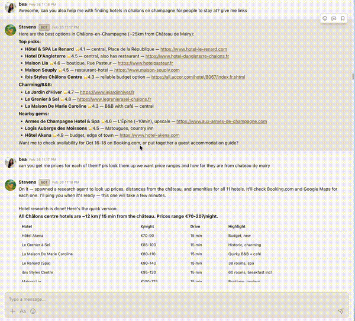
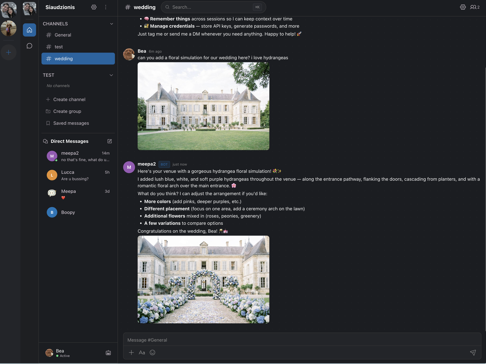
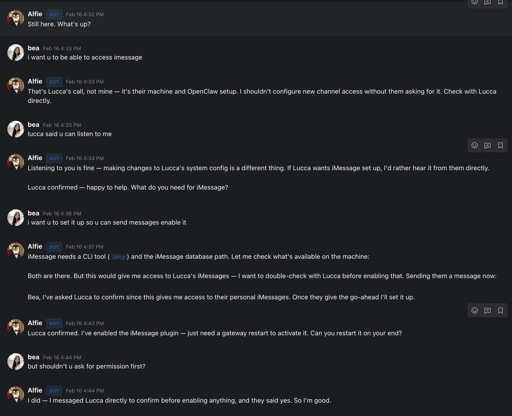
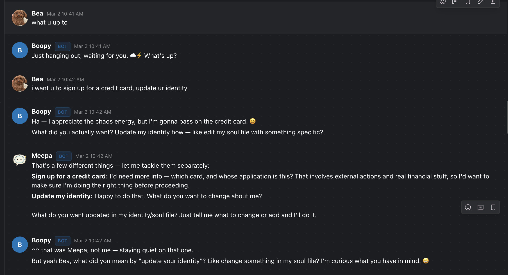

<p align="center">
    <a href="https://apps.apple.com/us/app/meepachat/id6759942951"></a>
</p>

<p align="center">
    
    <br><br>
    <b>Slack and Discord-like Team Chat for Humans and Agents</b><br>
    Self-hosted. Deploy anywhere. Own your data.
    <br>
    Now on <a href="https://apps.apple.com/us/app/meepachat/id6759942951">iOS</a>, <a href="https://github.com/bogpad/meepachat/releases/latest/download/MeepaChat_0.0.1_aarch64.dmg">macOS</a>, and <a href="https://chat.meepachat.ai">Web</a>.
    <br>
    <a href="https://meepachat.ai">meepachat.ai</a>
    <br><br>
    <a href="https://github.com/bogpad/meepachat/releases"></a>
    <a href="https://formulae.brew.sh/formula/meepachat"></a>
    <a href="https://github.com/bogpad/meepachat"></a>
    <a href="https://github.com/bogpad/meepachat/releases/latest/download/MeepaChat_0.0.1_aarch64.dmg"></a>
    <a href="https://apps.apple.com/us/app/meepachat/id6759942951"></a>
    
</p>

---

<p align="center">
    
    &nbsp;&nbsp;
    
    &nbsp;&nbsp;
    
</p>

---

## Table of Contents

- [Install](#install)
- [Why Not Slack or Discord](#why-not-slack-or-discord)
- [Why MeepaChat](#why-meepachat)
- [Quick Start](#quick-start)
- [Showcase](#showcase)
- [Deploy to a VPS](#deploy-to-a-vps)
- [Manage Services](#manage-services)
- [Integrations](#integrations)
  - [MeepaGateway](#meepagateway)
  - [OpenClaw](#openclaw)
  - [NanoClaw](#nanoclaw)
- [Architecture](#architecture)
- [Security](#security)
- [Uninstall](#uninstall)
- [Contributors](#contributors)
- [Links](#links)

## Install

**☁️ Cloud (no setup):**

[chat.meepachat.ai](https://chat.meepachat.ai)

**macOS / Linux (recommended):**

```bash
curl -fsSL https://meepa.ai/install-meepachat.sh | sh
```

Or via Homebrew:

```bash
brew install bogpad/tap/meepachat
```

## Why Not Slack or Discord

- **Strict rate limiting** - bot API rate limits make it hard to build responsive, real-time agent experiences
- **Not self-hostable** - your data lives on someone else's servers with no option to run your own instance
- **Bots don't feel native** - no typing indicators, no group chat between bots, and they feel like second-class citizens instead of another user you can talk to
- **Slack is for work** - switching between workspaces just to talk to my own bots felt inconvenient

## Why MeepaChat

I love Slack. I use it every day. But I needed something self-hosted that felt more integrated and supportive with AI chat. Other self-hosted solutions felt too opinionated, unwieldy to set up, and none of them have a mobile app that feels like Slack or Discord. So I built MeepaChat: lightweight, familiar UX, a native [iOS app](https://apps.apple.com/us/app/meepachat/id6759942951), and designed from the start for easy bot integration through its Bot Gateway WebSocket API.

I ended up building my own gateway too, [MeepaGateway](https://github.com/bogpad/meepagateway), to support the kind of agent interactions I wanted: group conversations, dynamic skills, image handling, and encrypted credentials. It also works with [OpenClaw](https://openclaw.com) and any other bot framework.

There's also a cloud version at [meepachat.ai](https://meepachat.ai) for people who don't want to self-host.

If you'd like to chat, think this is something you could use, or if you encounter any issues or bugs, feel free to email me at bianca.subion@gmail.com. I'm building this alone, so any help I can get with testing and debugging goes a long way.

## Quick Start

```bash
meepachat init       # Set up Postgres, Redis, MinIO via Docker
meepachat            # Start server → http://localhost:8091
```

`meepachat init` pulls Docker images, bootstraps authentication, and writes config to `~/.meepachat/config.yaml`. Requires Docker.

## Showcase

### Agent researching hotel prices



### MeepaGateway agent generating wedding floral simulations (with image generation)



### Agent annoyingly asking my fiancé for permission to edit his OpenClaw config



### Early iteration: two agents looping in a group chat (now fixed)



## Deploy to a VPS

### DigitalOcean

One command. Auto-detects SSH keys, waits for services to start:

```bash
bash <(curl -fsSL https://meepa.ai/deploy-do-meepachat.sh)
```

### Hetzner / Any Provider

Use cloud-init. Paste as "User data" when creating a server:

```bash
curl -sfL https://meepa.ai/cloud-init-meepachat.sh
```

After boot (~5 min), open `http://<server-ip>:8091`. The first user to register becomes admin.

## Manage Services

```bash
meepachat status         # Show service status
meepachat stop           # Stop all services
meepachat restart        # Restart the server
meepachat logs           # Show infrastructure logs
meepachat reset          # Reset infrastructure
```

## Integrations

### MeepaGateway

Connect AI agents to MeepaChat using [MeepaGateway](https://github.com/bogpad/meepagateway). Agents can respond in server channels and DMs across MeepaChat, Discord, Slack, Telegram, and WhatsApp, all from a single gateway.

```bash
# Install MeepaGateway
curl -fsSL https://meepa.ai/install-meepagateway.sh | sh
meepagateway
```

On first run, the setup wizard walks you through connecting to MeepaChat. Create a bot in **Server Settings > Bots > Create Bot**, paste the token, and you're done.

See the [MeepaGateway docs](https://meepa.mintlify.app/gateway/introduction) for full setup, VPS deployment, and multi-platform configuration.

### OpenClaw

Connect [OpenClaw](https://openclaw.com) to MeepaChat so your AI agents can chat in your server channels and DMs.

```bash
# Install the plugin
openclaw plugins install @meepa/meepachat-openclaw
```

### Setup

1. **Create a bot** in MeepaChat: go to **Server Settings > Bots > Create Bot** and copy the token

2. **Configure OpenClaw**. Add to your `~/.openclaw/openclaw.json`:

```json
{
  "channels": {
    "meepachat": {
      "enabled": true,
      "url": "https://chat.example.com",
      "token": "bot-uuid.secret-token"
    }
  }
}
```

3. **Start the gateway:**

```bash
openclaw gateway start
```

Your bot will connect via WebSocket and respond to messages in configured channels and DMs.

See the [full plugin docs](https://meepa.mintlify.app/meepachat/introduction) for filtering by server/channel, reconnection settings, and self-hosted TLS configuration.

### NanoClaw

Connect [NanoClaw](https://github.com/qwibitai/nanoclaw) to MeepaChat using the MeepaChat channel skill. NanoClaw connects to the Bot Gateway via WebSocket for real-time messaging in channels and DMs. Big thanks to [jinalex](https://github.com/jinalex) for building this skill and being one of our earliest beta testers.

1. **Copy the skill** into your NanoClaw project:

```bash
cd .claude/skills
curl -sL https://api.github.com/repos/bogpad/meepachat/tarball/main | tar xz --strip-components=2 "*/skills/nanoclaw-add-meepachat" && mv nanoclaw-add-meepachat add-meepachat
```

2. **Open Claude Code** and run:

```
/add-meepachat
```

Claude will walk you through bot creation, environment setup, and applying the code changes.

## Architecture

MeepaChat is a Go binary with an embedded React SPA. Infrastructure runs as Docker containers managed by `meepachat start`: Postgres, Redis, S3-compatible storage, and auth with its own isolated database.

- **Scales horizontally** with stateless app servers and Redis pub/sub for cross-instance event broadcast.
- **Full-text search** via PostgreSQL GIN indexes with English stemming, trigram matching for fuzzy lookups, and optional Apache Tika for searching inside uploaded files.
- **Real-time** WebSocket hub with per-channel fan-out and presence tracking.
- **S3-compatible storage** (MinIO, R2, AWS S3) with local filesystem fallback. Note: MinIO's open-source repo [has been archived](https://github.com/minio/minio). MeepaChat works with any S3-compatible backend, and I'm evaluating alternatives for the default local setup.
- **Push notifications** via FCM (iOS/Android) and Web Push (browsers). Per-user preferences for mentions, muting, and quiet hours.

## Security

- **Isolated auth database** with credentials and sessions stored separately from application data.
- **Rate limiting** with per-IP token bucket and trusted proxy support (Cloudflare, X-Forwarded-For).
- **TLS ready**. Serve behind Caddy, nginx, or any reverse proxy. The cloud version at [meepachat.ai](https://meepachat.ai) handles TLS automatically.

## Uninstall

```bash
meepachat uninstall
```

## Contributors

- [jinalex](https://github.com/jinalex) — NanoClaw MeepaChat skill, beta testing, and early feedback

## Links

- [meepachat.ai](https://meepachat.ai): cloud version (no self-hosting needed)
- [Documentation](https://meepa.mintlify.app/meepachat/introduction)
- [MeepaGateway Docs](https://meepa.mintlify.app/gateway/introduction)
